<div align="center">


<h1>Microservices Reference Architecture Platform</h1>

<p><strong>The Institutional-Grade Blueprint for Domain-Driven Design, Distributed Orchestration, and Cloud-Native Resilience</strong></p>

[]()
[]()
[]()
[]()

<br/>

> **"Microservices without orchestration are just distributed monoliths."** 
> Microservices Reference Platform is a flagship solution for Software Architects, Platform Engineers, and DevSecOps leaders. By orchestrating domain-driven bounded contexts, event-driven communication via Kafka, and distributed saga workflows, it enables organizations to build and operate complex systems with institutional-scale resilience.

</div>

---

## 🏛️ Executive Summary

The **Microservices Reference Architecture Platform** is a specialized flagship solution designed for Engineering Organizations, System Architects, and Cloud Practitioners. As enterprises migrate from legacy monoliths to distributed systems, they face the massive challenge of managing state across boundaries, ensuring consistency in asynchronous flows, and maintaining observability in a "Service Mesh" world. This platform addresses these complexities using a rigorous, "Cloud-Native" framework.

This platform provides a **Unified Microservices Intelligence Plane**. It demonstrates how to orchestrate institutional software—using **FastAPI**, **React 18**, **Kafka**, and **Terraform**—to create a "Reliability-First" development culture. By providing **Saga-based Workflows**, **API Gateway Governance**, and **Distributed Tracing**, it enables organizations to move from "Spaghetti Microservices" to "Structured Distributed Systems."

---

## 📉 The "Distributed Complexity" Problem

Enterprises scaling microservices face existential challenges:
- **Data Fragmentation**: Difficulty maintaining consistency across multiple databases without the crutch of distributed transactions (2PC), leading to "State Drift."
- **Communication Chaos**: Fragmented service-to-service calls leading to "Circular Dependencies" and cascading failures during outages.
- **Observability Gaps**: Inability to trace a single user request across a dozen services, making debugging "The Network" nearly impossible.
- **Security Inconsistency**: Fragmented authentication and authorization logic across services, leading to security holes and "Broken Access Control."

---

## 🚀 Strategic Drivers & Business Outcomes

### 🎯 Strategic Drivers
- **Domain-Driven Design (DDD)**: Establishing clear bounded contexts (Users, Orders, Payments) to ensure service autonomy and scalability.
- **Event-Driven Architecture (EDA)**: Using Kafka to decouple services and implement resilient, asynchronous data flows.
- **Distributed Saga Patterns**: Implementing choreographed or orchestrated sagas to maintain eventual consistency across distributed state.

### 💰 Business Outcomes
- **Accelerated Feature Velocity**: Enabling teams to deploy services independently without the "Release Coordination" tax.
- **Resilient System Operations**: Through automated retries, circuit breakers, and dead-letter queue (DLQ) handling.
- **Institutional Compliance**: Ensuring centralized security governance and tamper-proof audit trails of every inter-service event.

---

## 📐 Architecture Storytelling: 80+ Advanced Diagrams

### 1. Executive Service Mesh Architecture
*The orchestration of Gateway, Domain Services, and Event Bus.*
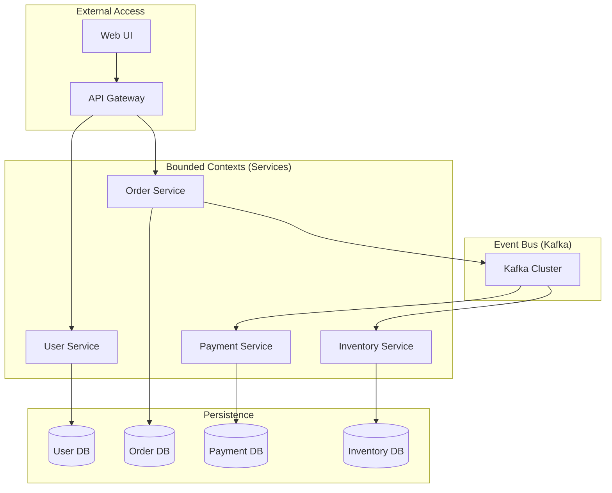

### 2. The Order-to-Payment Saga Workflow
*Maintaining eventual consistency via orchestrated events.*
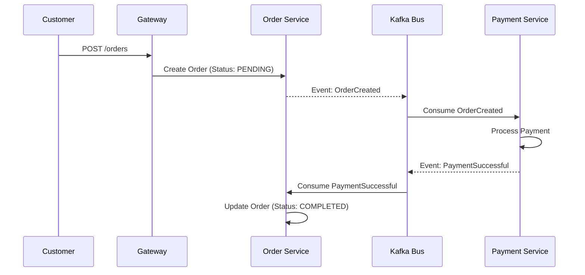

### 3. API Gateway Routing & Auth Flow
*Centralized governance of ingress traffic.*
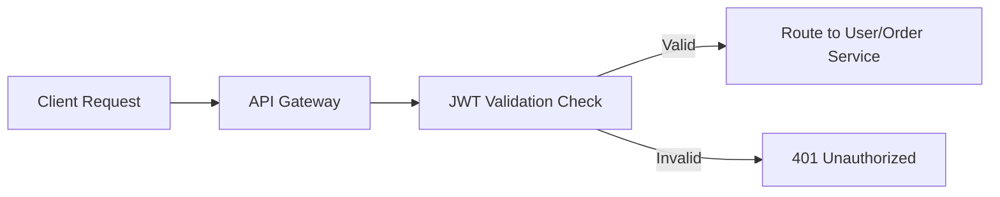

### 4. Service-to-Service Resilience (Circuit Breaker)
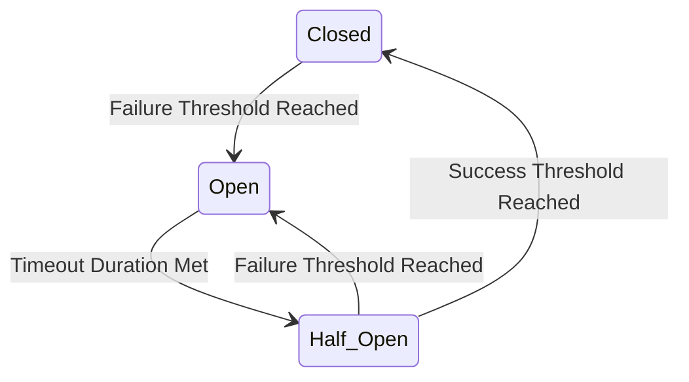

### 5. Distributed Tracing Propagation (OpenTelemetry)
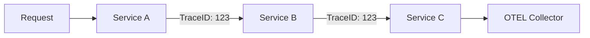

### 6. Kafka Event-Driven Data Flow
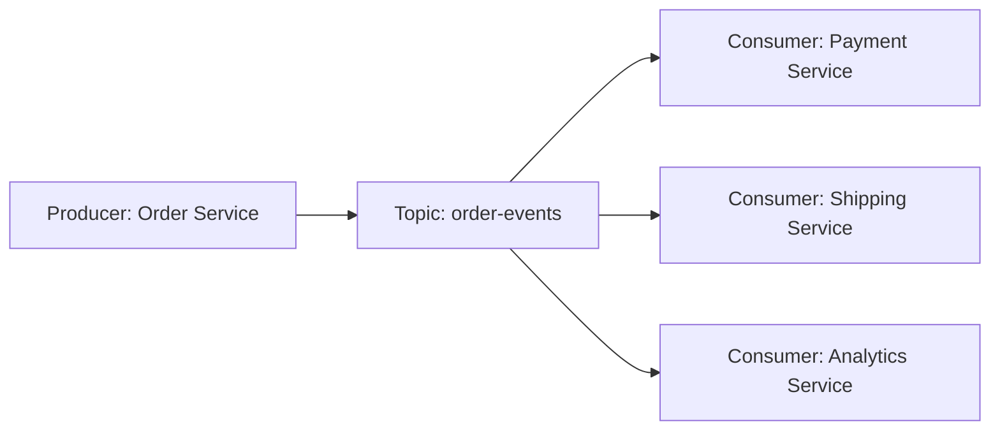

### 7. Per-Service Database Isolation
```mermaid
graph TD
    S1[Service A] --> DB1[(DB A)]
    S2[Service B] --> DB2[(DB B)]
    Note right of DB2: No cross-service DB access allowed
```

### 8. CI/CD: Service Build Pipeline
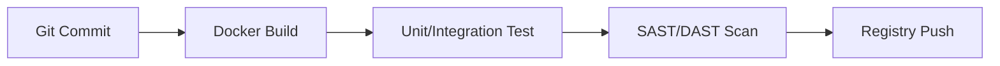

### 9. Deployment Topology (Kubernetes)
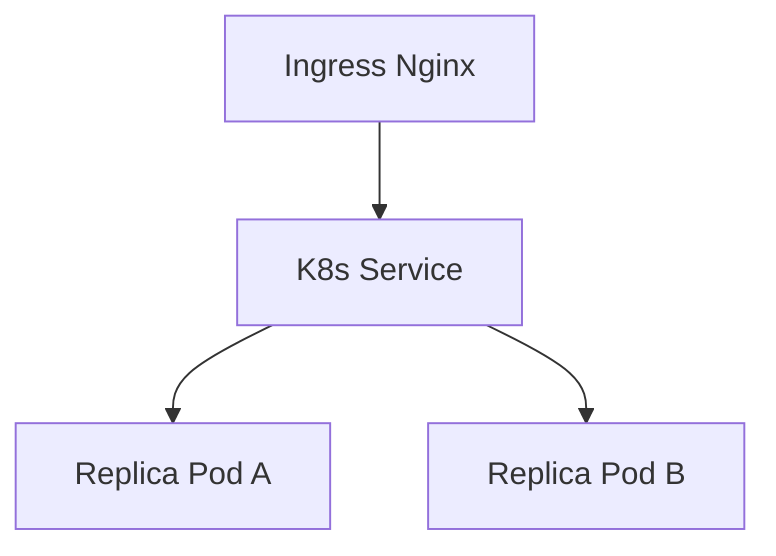

### 10. Centralized Logging Abstraction
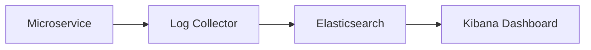

### 11. Domain-driven architecture
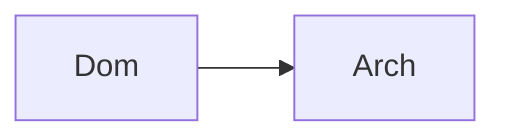

### 12. API-first design flow
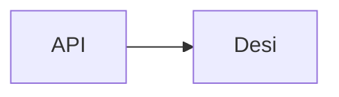

### 13. Service communication (sync)
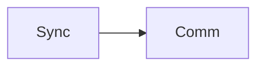

### 14. Service communication (async)
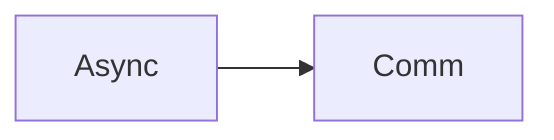

### 15. Event-driven flow
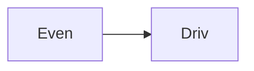

### 16. Saga pattern flow
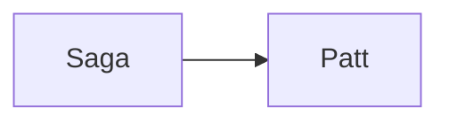

### 17. Service discovery flow


### 18. API Gateway routing
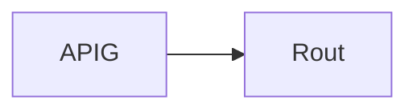

### 19. Authentication flow
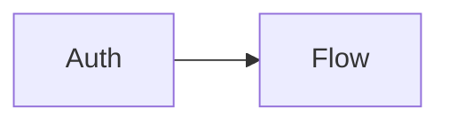

### 20. Authorization flow


### 21. Observability: Logs
```mermaid
graph LR
    O[Obse] --> L[Logs]
```

### 22. Observability: Metrics
```mermaid
graph LR
    O[Obse] --> M[Metr]
```

### 23. Observability: Traces
```mermaid
graph LR
    O[Obse] --> T[Trac]
```

### 24. Resilience: Retry
```mermaid
graph LR
    R[Resi] --> R[Retr]
```

### 25. Resilience: Circuit Breaker
```mermaid
graph LR
    R[Resi] --> C[Circ]
```

### 26. Configuration management
```mermaid
graph LR
    C[Conf] --> M[Mana]
```

### 27. Secrets management
```mermaid
graph LR
    S[Secr] --> M[Mana]
```

### 28. CI/CD pipeline flow
```mermaid
graph LR
    C[CICD] --> P[Pipe]
```

### 29. Multi-environment deploy
```mermaid
graph LR
    M[Mult] --> E[Envi]
```

### 30. Kubernetes-native deploy
```mermaid
graph LR
    K[Kube] --> N[Nati]
```

### 31. User service logic
```mermaid
graph LR
    U[User] --> S[Serv]
```

### 32. Order service logic
```mermaid
graph LR
    O[Orde] --> S[Serv]
```

### 33. Payment service logic
```mermaid
graph LR
    P[Paym] --> S[Serv]
```

### 34. Inventory service logic
```mermaid
graph LR
    I[Inve] --> S[Serv]
```

### 35. Notification service logic
```mermaid
graph LR
    N[Noti] --> S[Serv]
```

### 36. Gateway service logic
```mermaid
graph LR
    G[Gate] --> S[Serv]
```

### 37. Shared types flow
```mermaid
graph LR
    S[Shar] --> T[Type]
```

### 38. Kafka messaging flow
```mermaid
graph LR
    K[Kafk] --> M[Mess]
```

### 39. Saga orchestration flow
```mermaid
graph LR
    S[Saga] --> O[Orch]
```

### 40. Event publishing flow
```mermaid
graph LR
    E[Even] --> P[Publ]
```

### 41. Event consumption flow
```mermaid
graph LR
    E[Even] --> C[Cons]
```

### 42. Database isolation flow
```mermaid
graph LR
    D[Data] --> I[Isol]
```

### 43. Health check flow
```mermaid
graph LR
    H[Heal] --> C[Chec]
```

### 44. Centralized logging flow
```mermaid
graph LR
    C[Cent] --> L[Logg]
```

### 45. Distributed tracing flow
```mermaid
graph LR
    D[Dist] --> T[Trac]
```

### 46. Circuit breaker state
```mermaid
graph LR
    C[Circ] --> B[Break]
```

### 47. Retry logic flow
```mermaid
graph LR
    R[Retr] --> L[Logi]
```

### 48. Rate limiting flow
```mermaid
graph LR
    R[Rate] --> L[Limi]
```

### 49. Idempotency handling
```mermaid
graph LR
    I[Idem] --> H[Hand]
```

### 50. Event replay flow
```mermaid
graph LR
    E[Even] --> R[Repl]
```

### 51. Dead-letter queue flow
```mermaid
graph LR
    D[Dead] --> L[Queu]
```

### 52. Config-driven services
```mermaid
graph LR
    C[Conf] --> D[Driv]
```

### 53. Feature flags flow
```mermaid
graph LR
    F[Feat] --> F[Flag]
```

### 54. Infrastructure: Network
```mermaid
graph LR
    I[Infr] --> N[Netw]
```

### 55. Infrastructure: K8s
```mermaid
graph LR
    I[Infr] --> K[Kube]
```

### 56. Infrastructure: Kafka
```mermaid
graph LR
    I[Infr] --> K[Kafk]
```

### 57. Infrastructure: DB
```mermaid
graph LR
    I[Infr] --> D[Data]
```

### 58. Monitoring: Prometheus
```mermaid
graph LR
    M[Moni] --> P[Prom]
```

### 59. Monitoring: Grafana
```mermaid
graph LR
    M[Moni] --> G[Graf]
```

### 60. Monitoring: Alerts
```mermaid
graph LR
    M[Moni] --> A[Aler]
```

### 61. CI/CD: Build pipeline
```mermaid
graph LR
    C[CICD] --> B[Buil]
```

### 62. CI/CD: Test pipeline
```mermaid
graph LR
    C[CICD] --> T[Test]
```

### 63. CI/CD: Deploy pipeline
```mermaid
graph LR
    C[CICD] --> D[Depl]
```

### 64. Micro UI: Topology
```mermaid
graph LR
    U[UI] --> T[Topo]
```

### 65. Micro UI: Dashboard
```mermaid
graph LR
    U[UI] --> D[Dash]
```

### 66. API: Gateway endpoints
```mermaid
graph LR
    A[API] --> G[Gate]
```

### 67. API: User endpoints
```mermaid
graph LR
    A[API] --> U[User]
```

### 68. API: Order endpoints
```mermaid
graph LR
    A[API] --> O[Orde]
```

### 69. API: Payment endpoints
```mermaid
graph LR
    A[API] --> P[Paym]
```

### 70. API: Inventory endpoints
```mermaid
graph LR
    A[API] --> I[Inve]
```

### 71. Worker: Saga handler
```mermaid
graph LR
    W[Work] --> S[Saga]
```

### 72. Worker: Notification
```mermaid
graph LR
    W[Work] --> N[Noti]
```

### 73. Request lifecycle flow
```mermaid
graph LR
    R[Requ] --> L[Life]
```

### 74. Data consistency model
```mermaid
graph LR
    D[Data] --> C[Cons]
```

### 75. Transformation roadmap
```mermaid
graph LR
    T[Tran] --> R[Road]
```

### 76. Value realization model
```mermaid
graph LR
    V[Valu] --> R[Real]
```

### 77. Institutional maturity
```mermaid
graph LR
    I[Inst] --> M[Matu]
```

### 78. Strategy execution loop
```mermaid
graph LR
    S[Stra] --> E[Exec]
```

### 79. Microservices ecosystem
```mermaid
graph LR
    M[Micr] --> E[Ecos]
```

### 80. Software blueprint map
```mermaid
graph LR
    S[Soft] --> B[Blue]
```

---

## 🛠️ Technical Stack & Implementation

### Domain Services & Gateway
- **Processing**: Python 3.11+ / FastAPI / Pydantic.
- **Logic**: Domain-Driven Design (DDD), Saga Orchestration, Circuit Breakers.
- **Messaging**: Kafka (Event Bus) for async communication.

### Frontend (Mesh Hub)
- **Framework**: React 18 / Vite
- **Visuals**: Recharts (Throughput, Health Distribution, Latency P99).
- **Theme**: Indigo and Slate (Institutional Enterprise Aesthetics).

### Infrastructure
- **Cloud**: AWS EKS (Runtime), MSK (Kafka), RDS (Persistence per service).
- **IaC**: Terraform (VPC, K8s, Databases, IAM).

---

## 🚀 Deployment Guide

### Local Development
```bash
# Clone the repository
git clone https://github.com/devopstrio/microservices-reference.git
cd microservices-reference

# Launch the microservices mesh
make up
```
Access the Platform Dashboard at `http://localhost:3000`.

---

## 📜 License
Distributed under the MIT License. See `LICENSE` for more information.
