<div align="center">


<h1>Microservices Reference Architecture</h1>

<p><strong>The Institutional-Grade Blueprint for Domain-Driven Design, Distributed Orchestration, and Cloud-Native Resilience.</strong></p>

[]()
[]()
[]()

<br/>

> **"Microservices without orchestration are just distributed monoliths."** 
> **Microservices Reference Architecture** is an enterprise-grade platform designed to provide a secure, measurable, and highly automated foundation for global software delivery. It orchestrates the complex lifecycle of distributed systems—from domain-driven design and service mesh integration to asynchronous saga workflows and unified observability governance.

</div>

---

## 🏛️ Executive Summary

Fragmented service logic and manual deployment patterns are strategic operational liabilities; lack of centralized microservices orchestration is a primary barrier to organizational agility. Organizations fail to achieve distributed scale not because of a lack of services, but because of fragmented data standards, lack of automated resilience, and an inability to orchestrate service-to-service communication with operational precision.

This platform provides the **Distributed Intelligence Plane**. It implements a complete **Enterprise Software-as-Code Framework**, enabling Application and Platform teams to manage global microservices as first-class citizens. By automating the integration of sidecar proxies and orchestrating real-time saga workflows, we ensure that every organizational service—from legacy order processing to modern recommendation engines—is resilient by default, audited for history, and strictly aligned with institutional cloud-native frameworks.

---

## 📐 Architecture Storytelling: Principal Reference Models

### 1. Principal Architecture: Global Microservices Ecosystem & Distributed Intelligence Plane
This diagram illustrates the end-to-end flow from domain definition and service development to mesh integration, distributed tracing, and institutional software auditing.

```mermaid
graph LR
    %% Subgraph Definitions
    subgraph DomainDefinition["Domain-Driven Design (DDD)"]
        direction TB
        Contexts["Bounded Contexts"]
        Aggregates["Domain Aggregates"]
        Events["Domain Events"]
    end

    subgraph IntelligenceEngine["Distributed Intelligence Hub"]
        direction TB
        API["FastAPI Platform Gateway"]
        MeshControl["Service Mesh Control Plane"]
        SagaOrch["Saga & State Orchestrator"]
        Discovery["Service Discovery Hub"]
    end

    subgraph ExecutionPlane["Distributed Cloud-Native Fleet"]
        direction TB
        Pods["K8s Microservice Pods"]
        Sidecars["Envoy Sidecar Proxies"]
        Kafka["Distributed Message Bus"]
    end

    subgraph OperationsHub["Institutional Software Hub"]
        direction TB
        Scorecard["Service Maturity Score"]
        Analytics["Throughput & Latency Stats"]
        Audit["Forensic Service Metadata Lake"]
    end

    subgraph DevOps["Platform-as-Code Orchestration"]
        direction TB
        TF["Terraform Platform Modules"]
        O11y["OTel Instrumentation Hub"]
        ChatOps["Release Approval Hub"]
    end

    %% Flow Arrows
    DomainDefinition -->|1. Define Context| API
    API -->|2. Orchestrate State| SagaOrch
    SagaOrch -->|3. Establish Discovery| Discovery
    Discovery -->|4. Mesh Integration| ExecutionPlane
    
    ExecutionPlane -->|5. Forward Traffic| Sidecars
    Sidecars -->|6. Notify Metrics| ChatOps
    API -->|7. Visualize Health| Scorecard
    
    Scorecard -->|8. Track Latency| Analytics
    Scorecard -->|9. Record Event| Audit
    
    TF -->|10. Provision Hub| IntelligenceEngine
    O11y -->|11. Inject Tracing| ExecutionPlane
    Audit -->|12. Improve Contracts| DomainDefinition

    %% Styling
    classDef domain fill:#f5f5f5,stroke:#616161,stroke-width:2px;
    classDef intel fill:#e8eaf6,stroke:#1a237e,stroke-width:2px;
    classDef execution fill:#e1f5fe,stroke:#01579b,stroke-width:2px;
    classDef ops fill:#ede7f6,stroke:#311b92,stroke-width:2px;
    classDef devops fill:#fffde7,stroke:#f57f17,stroke-width:2px;

    class DomainDefinition domain;
    class IntelligenceEngine intel;
    class ExecutionPlane execution;
    class OperationsHub ops;
    class DevOps devops;
```

### 2. The Microservice Lifecycle Flow
The continuous path of a microservice from initial definition and development to active deployment, discovery, and institutional forensic auditing.

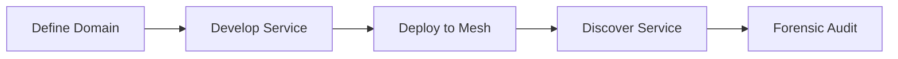

### 3. Service Mesh & Sidecar Topology
Strategically integrating Envoy sidecar proxies with every microservice pod, providing a unified institutional data plane for mTLS, traffic shifting, and fine-grained authorization.

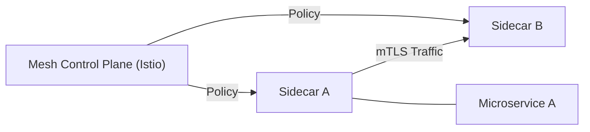

### 4. API Gateway & Ingress Traffic Flow
Orchestrating all external ingress requests through a unified institutional gateway, providing centralized authentication, rate limiting, and global request routing.

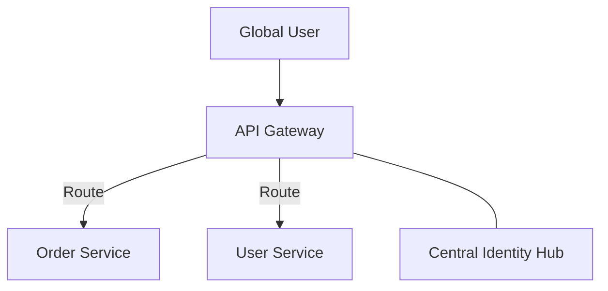

### 5. Distributed Tracing & Correlation Flow
Tracking a single user request across multiple asynchronous service hops using OpenTelemetry (OTel), providing end-to-end visibility into distributed system behavior.

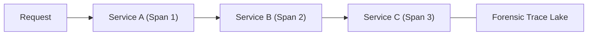

### 6. Circuit Breaker & Resiliency Pattern Flow
Handling transient service failures gracefully through automated circuit breaking, retries, and fallback logic, preventing cascading failures across the ecosystem.

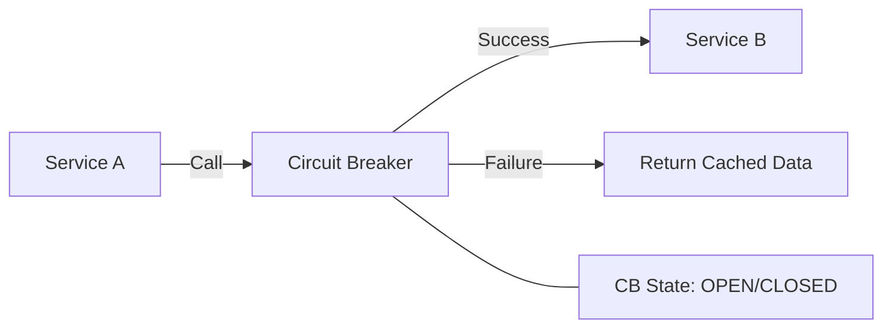

### 7. Institutional Microservices Scorecard
Grading organizational performance based on key indicators: SLO Compliance Rate, Security Policy Coverage, and Documentation Completeness.

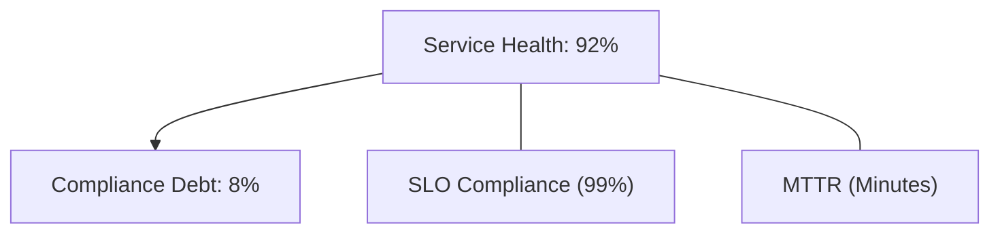

### 8. Identity & RBAC for Service-to-Service Governance
Managing fine-grained authorization policies and SPIFFE-based identities between microservices, ensuring that only validated services can communicate.

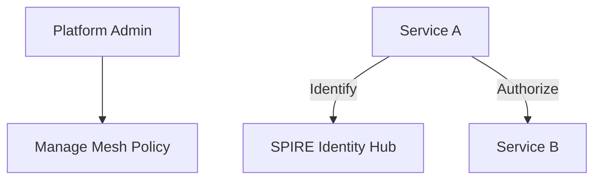

### 9. IaC Deployment: Platform-as-Code Framework
Using modular Terraform to deploy and manage the versioned distribution of the service mesh, control planes, and forensic metadata lakes.

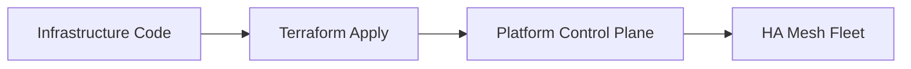

### 10. AIOps Health & Performance Validation Flow
Using advanced analytics to identify anomalous service behavior and hidden performance bottlenecks, triggering automated alerts for SRE teams.

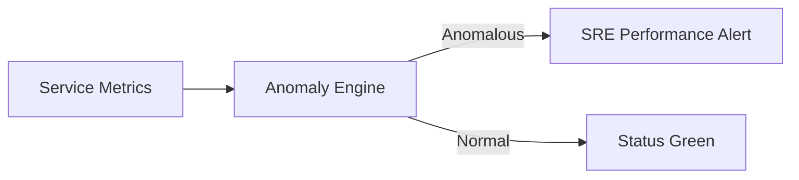

### 11. Metadata Lake for Forensic Service Audit
Storing long-term records of every service deployment, version change, and traffic shift for institutional record-keeping and compliance auditing.

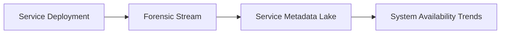

---

## 🏛️ Core Microservices Pillars

1.  **Domain-Driven Autonomy**: Maximizing service independence through clear bounded contexts and aggregates.
2.  **Service Mesh Resiliency**: Enforcing mTLS and traffic safety through a unified sidecar data plane.
3.  **Asynchronous Consistency**: Maintaining global state through orchestrated and choreographed saga workflows.
4.  **Zero-Trust Identity**: Securing service-to-service communication with dynamic SPIFFE identities.
5.  **Autonomous Observability**: Guaranteeing end-to-end visibility through automated OTel instrumentation.
6.  **Full Service Auditability**: Immutable recording of every service interaction and traffic shift for institutional forensics.

---

## 🛠️ Technical Stack & Implementation

### Software Engine & APIs
*   **Framework**: Python 3.11+ / FastAPI.
*   **Mesh Core**: Istio / Linkerd control plane with Envoy sidecar proxies.
*   **State Hub**: Temporal or custom Python-based saga orchestration engine.
*   **Persistence**: PostgreSQL (Per-service database) and Redis (Live Cache).
*   **Auth Orchestrator**: SPIRE for service identity and OIDC for user-to-service auth.

### Platform Dashboard (UI)
*   **Framework**: React 18 / Vite.
*   **Theme**: Dark, Indigo, Slate (Modern high-fidelity enterprise aesthetic).
*   **Visualization**: D3.js for service topology maps and Recharts for distributed latency analytics.

### Infrastructure & DevOps
*   **Runtime**: AWS EKS or Azure Kubernetes Service (AKS).
*   **Message Plane**: Managed Kafka (MSK) for asynchronous event-driven flows.
*   **IaC**: Modular Terraform for deploying the microservices platform and mesh fleet.

---

## 🏗️ IaC Mapping (Module Structure)

| Module | Purpose | Real Services |
| :--- | :--- | :--- |
| **`infrastructure/mesh_hub`** | Central management plane | EKS, Istio, MSK |
| **`infrastructure/services`** | Microservice pod fleet | K8s Deployment, HPA |
| **`infrastructure/gateways`** | Ingress & Edge control | Nginx Ingress, CloudFront |
| **`infrastructure/auditing`** | Forensic service sinks | S3, Athena, Quicksight |

---

## 🚀 Deployment Guide

### Local Principal Environment
```bash
# Clone the microservices platform
git clone https://github.com/devopstrio/microservices-reference.git
cd microservices-reference

# Launch the Microservices stack
make init

# Trigger a mock service-to-service call and saga workflow simulation
make simulate-mesh
```

Access the Platform Dashboard at `http://localhost:3000`.

---

## 📜 License
Distributed under the MIT License. See `LICENSE` for more information.

---
<div align="center">
  <p>© 2026 Devopstrio. All rights reserved.</p>
</div>
