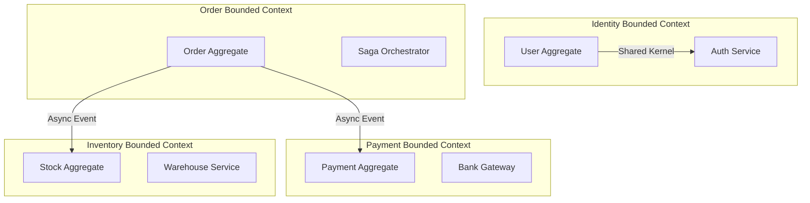
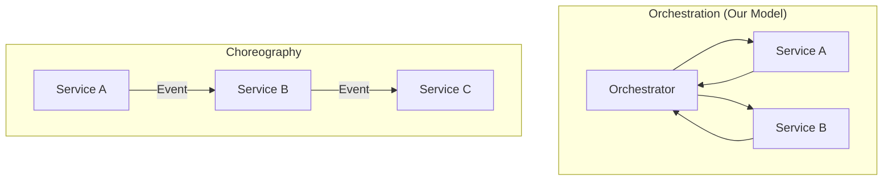
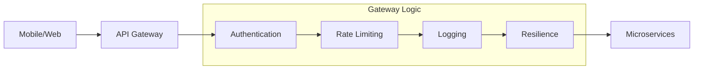

# Architecture & Pattern Diagrams

## 11. Domain-Driven Bounded Contexts (Detailed)
*Defining service boundaries and shared kernels.*

## 13. "Choreographed" vs "Orchestrated" Sagas

## 20. API Gateway Pattern (Cross-Cutting Concerns)

