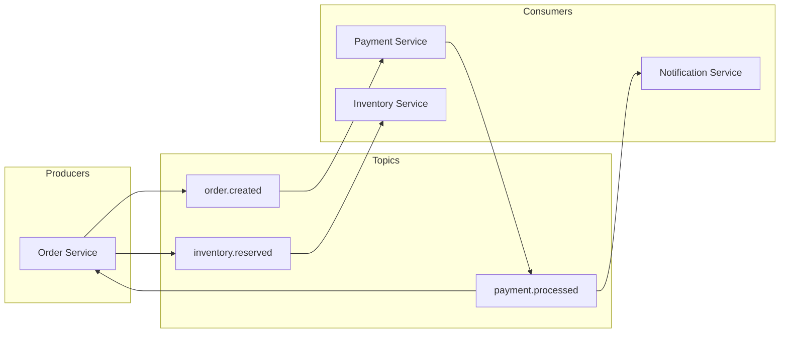
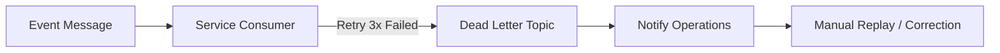

# Event-Driven & Observability Diagrams

## 31. Kafka Topic Topology


## 34. Distributed Tracing Flow (mTLS / Headers)
```mermaid
graph LR
    Gate[Gateway] -->|x-trace-id: 999| S1[Service A]
    S1 -->|x-trace-id: 999| S2[Service B]
    S2 -->|x-trace-id: 999| S3[Service C]
    Note right of Gate: Header Propagation Logic
```

## 40. "Dead Letter Queue" (DLQ) Pattern

